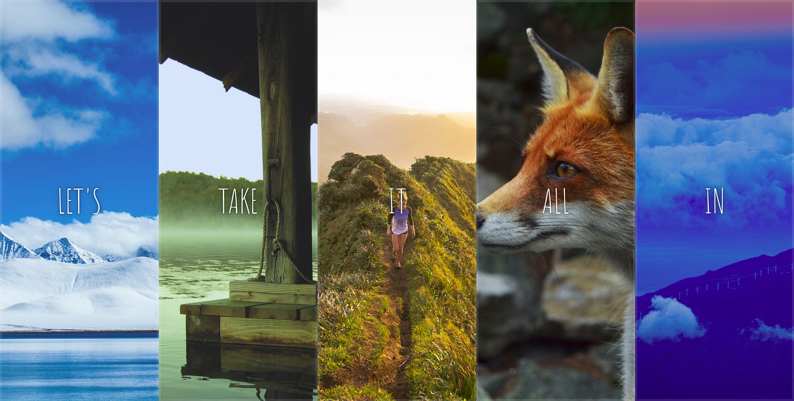

# 05-Flex-Panel-Gallery

Date: July 7, 2022

# Fifth challange of [JavaScript30](https://javascript30.com/)

Its a webpage with flex panels. To experience on your own visit [here](https://rohit-saini7.github.io/05-Flex-Panel-Gallery/)

## What is JavaScript 30

JavaScript 30 is a course taught by Wes Bos. With over 500,000 students, JavaScript 30 is build on the premise that you'll build 30 projects in 30 days. You do need to have an understanding of JavaScript before taking on JavaScript 30.

Learn more about the course in [here](https://javascript30.com/).

## Screenshot

Blue Mountains by [Jacques Bopp](https://unsplash.com/@jacquesbopp) on [Unsplash](https://unsplash.com/s/photos/blue-mountains)
River Dock by [Mikey B.](https://unsplash.com/@mikeyhassnapped) on [Unsplash](https://unsplash.com/s/photos/river-dock)
Bicycle by [Patrick Hendry](https://unsplash.com/@worldsbetweenlines) on [Unsplash](https://unsplash.com/s/photos/bicycle)
Fox by [Qijin Xu](https://unsplash.com/@obkim) on [Unsplash](https://unsplash.com/s/photos/fox)
Sunrise by [OC Gonzalez](https://unsplash.com/@ocvisual) on [Unsplash](https://unsplash.com/s/photos/sunrise)
